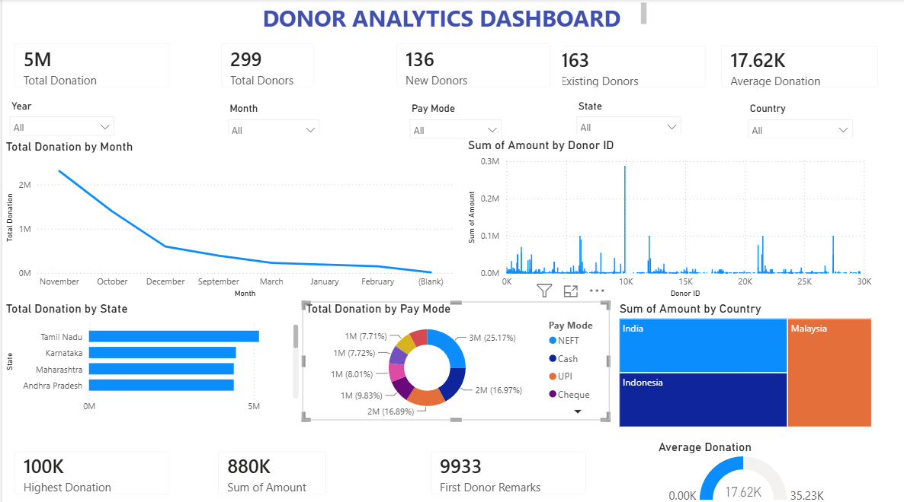
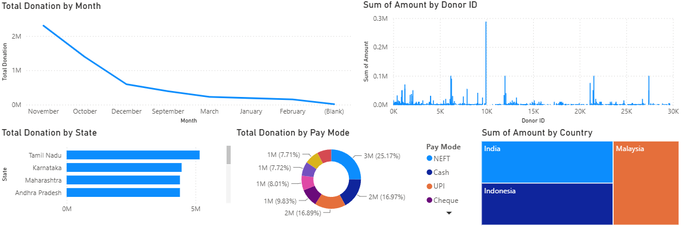
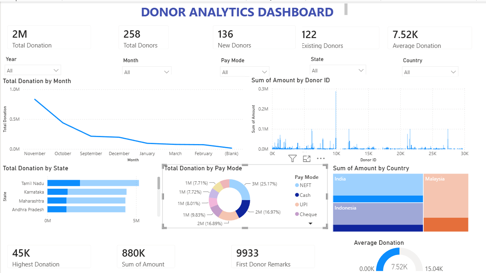

# 📊 Donor Analytics Dashboard

An interactive Power BI dashboard designed to analyze donor behavior, donation trends, payment methods, and geographical insights. This project demonstrates data cleaning, data modeling, and business intelligence visualization using Power BI.

---

## 📌 Project Overview

The goal of this project is to transform raw donor data into meaningful insights that help organizations understand:

- Total donations received
- Number of donors
- New vs Existing donors
- Average donation amount
- Donation trends over time
- Preferred payment methods
- State-wise and country-wise donations

The project includes data cleaning using Python and interactive dashboards created in Microsoft Power BI.

---

## 🎯 Objectives

- Clean and preprocess donor data.
- Analyze donation patterns.
- Compare new and existing donors.
- Identify high-performing regions.
- Visualize donation trends.
- Build an interactive dashboard for business decision making.

---

## 🛠 Tools & Technologies

- Microsoft Power BI
- Python
- Pandas
- OpenPyXL
- Microsoft Excel
- Git
- GitHub

---

## 📂 Project Structure

```
Donor-Analytics-Dashboard
│
├── Dashboard
│   └── Donor_Analytics_Dashboard.pbix
│
├── Dataset
│   ├── Cleaned_Donors.xlsx
│   └── Original_Dataset.xlsx
│
├── Python
│   └── clean_donors.py
│
├── Documentation
│   └── Data_Cleaning_Report.txt
│
├── Images
│   ├── Dashboard_overview.png
│   ├── Dashboard_filtered.png
│   └── Dashboard_charts.png
│
└── README.md
```

---

## 📊 Dashboard Features

### KPI Cards

- Total Donation
- Total Donors
- New Donors
- Existing Donors
- Average Donation
- Highest Donation

---

### Interactive Filters

- Year
- Month
- State
- Country
- Payment Mode

---

### Visualizations

- Monthly Donation Trend (Line Chart)
- Donation by State (Bar Chart)
- Donation by Payment Mode (Donut Chart)
- Donation by Country (Treemap)
- Donation Distribution by Donor ID
- Average Donation Gauge

---

## 🧹 Data Cleaning

The dataset was cleaned using Python before importing into Power BI.

Cleaning tasks included:

- Removing duplicate records
- Handling missing values
- Standardizing column names
- Fixing inconsistent data
- Creating New Donor and Existing Donor datasets
- Exporting cleaned Excel files

---

## 📈 Key Insights

- Total Donations: **5 Million**
- Total Donors: **299**
- New Donors: **136**
- Existing Donors: **163**
- Average Donation: **17.62K**
- Highest Donation: **100K**

*(Values depend on the dataset used.)*

---

## 🖼 Dashboard Preview

### Dashboard Overview



### Charts



### Interactive Filtering



---

## 🚀 How to Run

### Clone the repository

```bash
git clone https://github.com/ShakeelR-747/Donor-Analytics-Dashboard.git
```

### Open Power BI

Open:

```
Dashboard/Donor_Analytics_Dashboard.pbix
```

### Run Python Cleaning Script (Optional)

```bash
python clean_donors.py
```

---

## 📚 Skills Demonstrated

- Data Cleaning
- Data Transformation
- Data Visualization
- Dashboard Design
- KPI Creation
- DAX Measures
- Business Intelligence
- Git & GitHub

---

## 👤 Author

**Shakeel Rayyan**

GitHub:
https://github.com/ShakeelR-747

---

## ⭐ If you found this project useful

Give this repository a ⭐ on GitHub!
